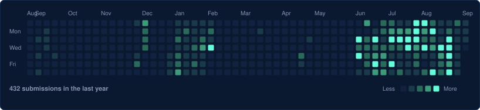

<div align="center">
  <h1>Ananya Karn</h1>
  <h3>Cloud | DevOps | AIML</h3>
  <p>
    <a href="https://kripinya.github.io/kripinya/"><strong>View Live Portfolio</strong></a>
  </p>
</div>

<br>

---

## Executive Summary

Final-year **B.Tech Computer Science (Cloud Computing & Virtualization Technology)** undergraduate at **UPES Dehradun** (2023-2027).

Specializing in the intersection of **Cloud Infrastructure, DevOps Automation, and Applied Machine Learning (AI/ML)**. Published researcher in aerospace ML (*IEEE ICADS 2026*). Currently collaborating with **IBM** on a Multi-Cloud FinOps platform, with prior experience as an Analytics Intern at **G Smart Investor LLP**.

* **Primary Stack**: Java, Python, AWS, Docker, Kubernetes, SQL, AI/ML etc.

---

## Key Highlights

<div align="center">
  <table>
    <tr>
      <td align="center" width="230">
        <br/>
        <sub><b>Scopus Indexed Paper</b></sub>
      </td>
      <td align="center" width="230">
        <br/>
        <sub><b>Java & DSA</b></sub>
      </td>
      <td align="center" width="230">
        <br/>
        <sub><b>AWS Academy Certifications</b></sub>
      </td>
    </tr>
  </table>
</div>

---

## Projects

<table>
  <thead>
    <tr>
      <th>Project</th>
      <th>Domain</th>
      <th>Key Stack</th>
      <th>Links</th>
    </tr>
  </thead>
  <tbody>
    <tr>
      <td><b>ML & Cloud Turbulence Prediction</b></td>
      <td>Aerospace ML</td>
      <td><code>Python</code> <code>AWS</code> <code>ML Models</code></td>
      <td><a href="https://ieeexplore.ieee.org/document/11545462">IEEE Paper</a> · <a href="https://github.com/kripinya/Cloud-Based-Turbulence-Prediction-System-Aviation-Safety-.git">Code</a></td>
    </tr>
    <tr>
      <td><b>Self-Healing Cloud / Niramay</b></td>
      <td>Cloud Infrastructure & DevOps</td>
      <td><code>Kubernetes</code> <code>Docker</code> <code>Causal AI</code></td>
      <td><a href="https://github.com/self-healing-cloud/healing-layer.git">Healing Layer</a> · <a href="https://github.com/kripinya/niramay.git">Niramay</a></td>
    </tr>
    <tr>
      <td><b>Multi-Cloud FinOps Dashboard</b></td>
      <td>FinOps & Billing</td>
      <td><code>AWS</code> <code>Azure</code> <code>GCP</code> <code>Flask</code></td>
      <td><a href="https://github.com/kripinya/Multi-Cloud-Cost-Monitoring-Dashboard-Cloud-FinOps-.git">IBM Collaboration</a></td>
    </tr>
    <tr>
      <td><b>Serverless Malware Scanner</b></td>
      <td>Serverless Security</td>
      <td><code>AWS Lambda</code> <code>Java 17</code> <code>S3</code></td>
      <td><a href="https://github.com/kripinya/serverlessMalwareScanner.git">Repository</a></td>
    </tr>
    <tr>
      <td><b>Know Your Footprints</b></td>
      <td>AI-Driven Systems</td>
      <td><code>Claude Code</code> <code>Prompt Engineering</code></td>
      <td><a href="https://github.com/kripinya/know-your-footprints">Repository</a></td>
    </tr>
    <tr>
      <td><b>Road Pothole Detection System</b></td>
      <td>Computer Vision / AI</td>
      <td><code>Python</code> <code>OpenCV</code> <code>ML</code></td>
      <td><a href="https://github.com/kripinya/road-pothole-detection-system.git">Repository</a></td>
    </tr>
  </tbody>
</table>

---

## Technical Capabilities

```
[Languages]          Java, Python, SQL
[Data Structures]    Arrays, Linked Lists, Stacks, Queues, Trees, Graphs, Recursion, DP etc.
[Cloud Platforms]    AWS (EC2, S3, IAM, Lambda, VPC), Azure Cost Management, GCP Billing API, Serverless
[DevOps & Tooling]   Docker, Kubernetes, CI/CD, Git, Linux, OpenTelemetry, Redis
[ML & AI]            Causal AI, Isolation Forest, XGBoost, Feature Engineering, Model Evaluation
[AI Workflows]       Claude, Prompt Engineering, Autonomous Scaffolding
[CS Core]            Operating Systems, Computer Networks, DBMS, OOP, System Design
```

---

## LeetCode Contributions

<div align="center">
  <a href="https://leetcode.com/u/ananyakarn_kripinya/">
    
  </a>
</div>

---

## Contact & Connect

<div align="center">

<p>
  <a href="https://www.linkedin.com/in/kripinya/"></a>
  <a href="https://leetcode.com/u/ananyakarn_kripinya/"></a>
  <a href="mailto:kripinya@gmail.com"></a>
  <a href="https://github.com/kripinya"></a>
</p>


</div>
